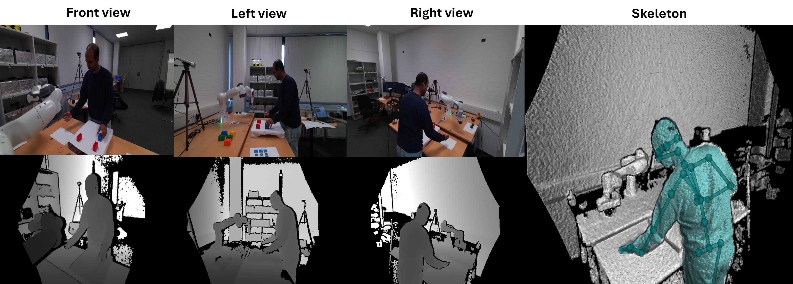

<h1>MHRC: A Multimodal Human-Robot Collaboration Dataset for Human Motion Estimation</h1>
<h3> <i>Sakif Hossain, Jörg P. Müller, and Madhumitha Kesavan</i></h3>
<h4> <i>Clausthal University of Technology, Germany</i></h4>
 
 

In this repository we present MHRC, a multimodal, simple task-based human-robot collaboration (HRC) dataset for human motion estimation. This dataset provides RGB, depth, and 3D skeleton data from 10 participants (5 repetitions each) performing a block arrangement task in collaboration with a Franka Emika Panda robot. The dataset contains a total of 2190 samples, each containing 40 frames for each data modality.

### Dataset description

 
### Get the data

[Download data](https://zenodo.org/uploads/17311081)

### Citing
 If you use our code, please cite our work (**TBD**)
